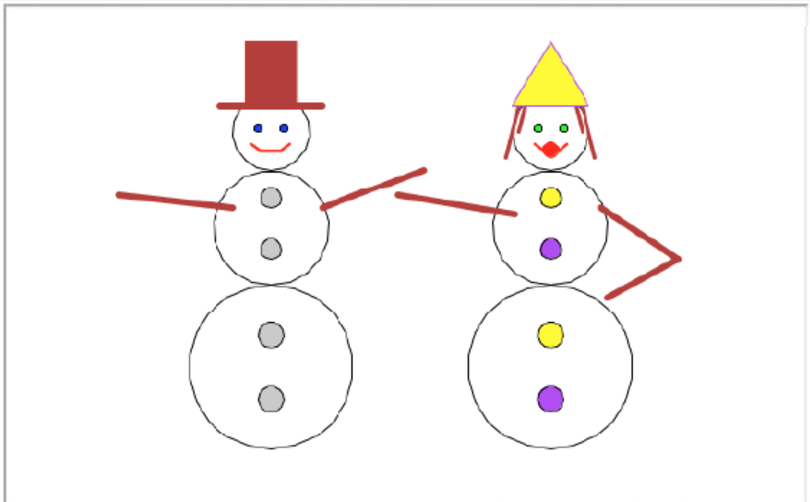
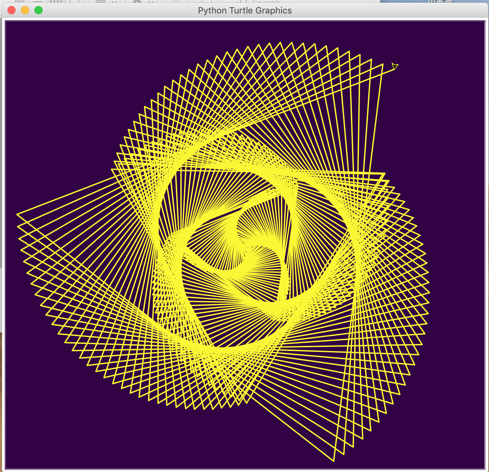
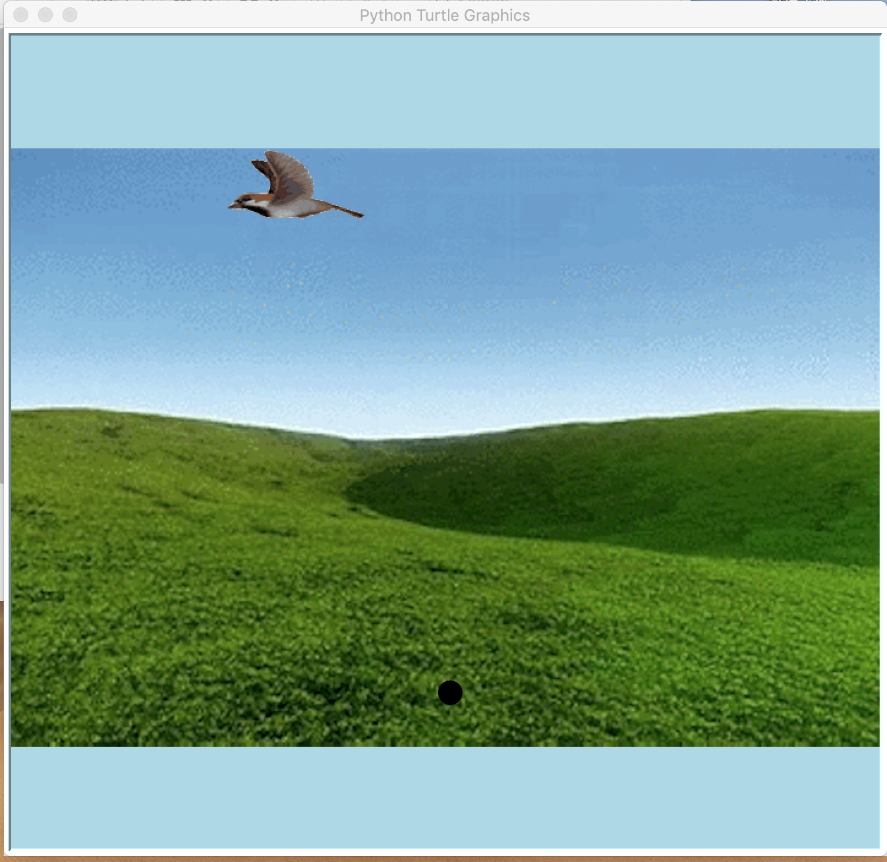
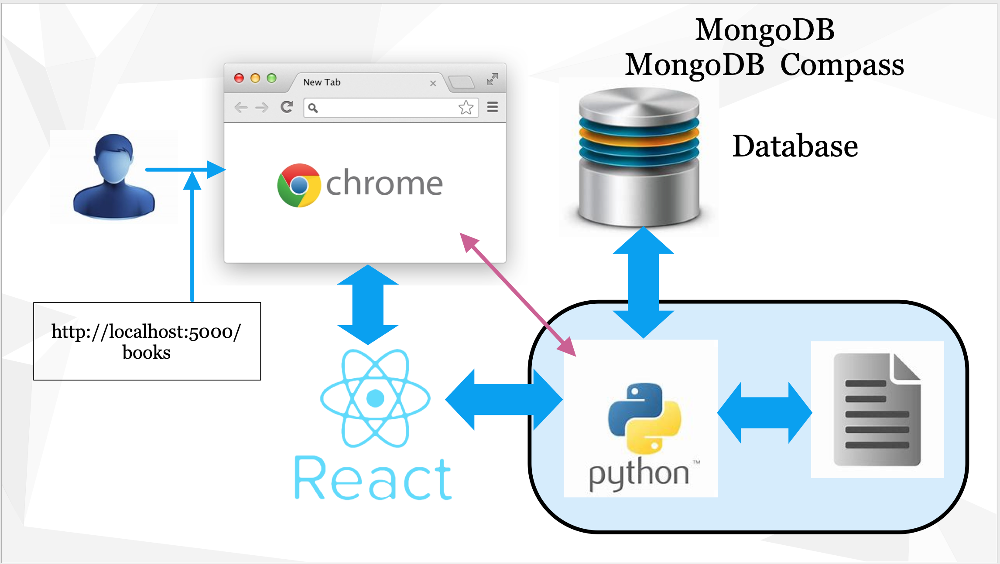
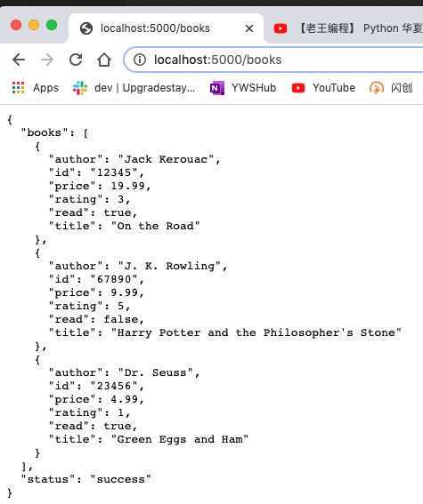
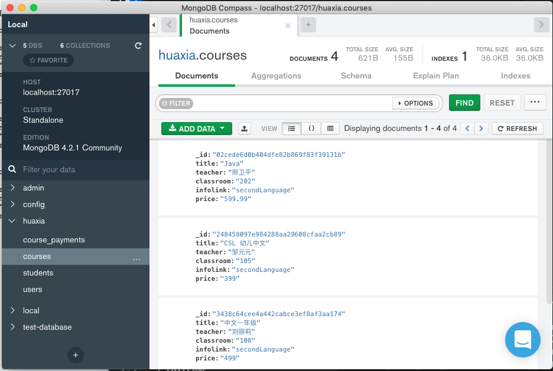
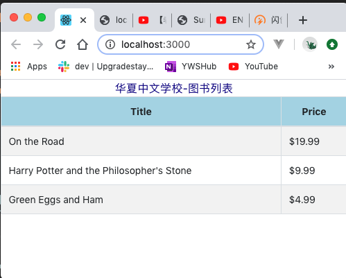

# 华夏中文学校Python计算机语言课程简介

华夏中文学校开设儿童及成人Python语言的编程课程。对于儿童而言旨在让孩子早期接触计算机语言，了解计算机软件的编制过程，以便今后在学校参加课外计算机小组，参加各种计算机语言比赛，有利于将来为好的学校录取加分。对于成人而言，可以帮助家长学习一门新的技能，在当前的工作市场，增加一个寻找好的工作的机会。

无论是成人班还是儿童班，都设置两个级别，即初级python语言入门，以及高级应用软件都制作。对于儿童来说，偏重游戏，绘图的编写。如：

## 简单图形到绘制方法，

## 数学公式到图形显示

## 加农炮打飞鸟到简单游戏制作，

对于成人来说，则注重语言基础，实体模拟方法及功能块导向编程方法概念到建立，以及网络应用软件到制作全过程，包括前台显示，中间服务器到编写，以及后台MongoDB数据库到建立，读写修改全套制作方法。课程中会介绍所有工具到安装及应用方法。

下图简明扼要介绍网络应用软件的各个服务器的相互关系

例如：
## python直接与浏览器到连接，

## MongoDB 数据库数据到存取及删除修改，

## 前台数据显示

## 报名学习的学员，要求自备计算机，Windows，Apple均可。