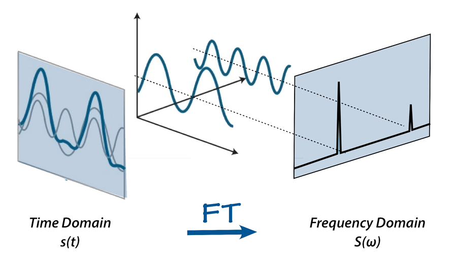
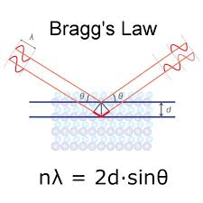
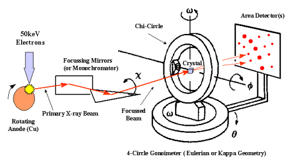
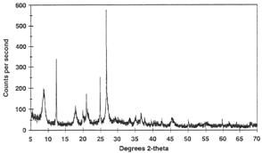

# Fourier Transformation

## Euler's Formular (God Equation)

$$e^{i \pi} + 1 = 0$$

$$e^{i \pi} = cos(\pi) + i\ sin(\pi) = -1$$

$$x\ e^{i\pi} = -x;\ \ x\ e^{i\frac{\pi}{2}} = i\ x$$


## Taylor series

$$e^x = \sum_{n=0}^{\infty}\frac{x^n}{n!}$$

$$e^x = cos(x) + i\ sin(x)$$

$$e^x = \sum_{n=0}^{\infty}{\frac{x^{n}}{n!}}=1+x+\frac {x^{2}}{2!}+\frac {x^{3}}{3!}+\cdots +\frac {x^{n}}{n!}+\cdots $$

$$e^{i\theta}=1+{i\theta}+\frac{1}{2!}({i\theta})^2+\frac{1}{3!}({i\theta})^3+ \frac{1}{4!} ({i\theta})^4+ \frac{1}{5!} ({i\theta})^5 + \cdots$$
$$= (1 - \frac{\theta^2}{2!} + \frac{\theta^4}{4!} + \cdots) + i(\theta -\frac{\theta^3}{3!} + \frac{\theta^5}{5!} + \cdots)$$
$$= cos(\theta) + i\ sin(\theta)$$
$$e^{i \theta} = cos(\theta) + i\ sin(\theta)$$

## Fourier Transform

$$f(\omega) = \int_{-\infty}^{\infty} f(t) e^{-2\pi i t \omega} dt $$

$\omega$ ：角频率，圆频率

$f(t)$ : 时域 （Time Domain）

$f(\omega)$ : 频域 （Frequency Domain）



## 声音的波形分析
那么如果给你随意一段随时间变化的气压曲线，你如何找到这些原有的组成音符呢？这就是我们的目的


## Xray Diffraction






## Website Reference
[Audio FFT](https://towardsdatascience.com/understanding-audio-data-fourier-transform-fft-spectrogram-and-speech-recognition-a4072d228520)

[声音解析-傅立叶变换](https://charlesliuyx.github.io/2018/02/18/%E3%80%90%E7%9B%B4%E8%A7%82%E8%AF%A6%E8%A7%A3%E3%80%91%E8%AE%A9%E4%BD%A0%E6%B0%B8%E8%BF%9C%E5%BF%98%E4%B8%8D%E4%BA%86%E7%9A%84%E5%82%85%E9%87%8C%E5%8F%B6%E5%8F%98%E6%8D%A2%E8%A7%A3%E6%9E%90/)

## Monte Carlo Simulation
[Monte Carlo Wikipedia](https://en.wikipedia.org/wiki/Monte_Carlo_method)

[Monte Carlo Simulation in Python](https://www.youtube.com/watch?v=BfS2H1y6tzQ)
```Greek letters
α \alpha κ \kappa ψ \psi z \digamma ∆ \Delta Θ \Theta
β \beta λ \lambda ρ \rho ε \varepsilon Γ \Gamma Υ \Upsilon
χ \chi µ \mu σ \sigma κ \varkappa Λ \Lambda Ξ \Xi
δ \delta ν \nu τ \tau ϕ \varphi Ω \Omega
 \epsilon o o θ \theta $ \varpi Φ \Phi ℵ \aleph
η \eta ω \omega υ \upsilon % \varrho Π \Pi i \beth
γ \gamma φ \phi ξ \xi ς \varsigma Ψ \Psi k \daleth
ι \iota π \pi ζ \zeta ϑ \vartheta Σ \Sigma ג\ gimel
```