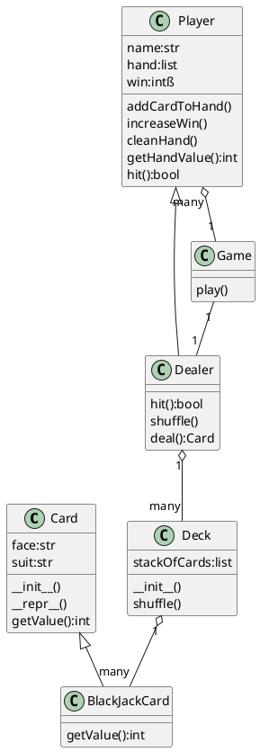
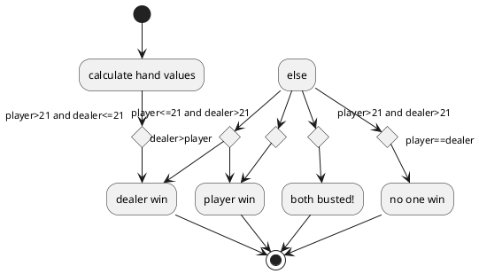

# Plant UML
* [VS Code UML](https://marketplace.visualstudio.com/items?itemName=jebbs.plantuml)
* [Class Diagram Syntax](https://plantuml.com/class-diagram)
* [Squence Diagram Syntax](https://plantuml.com/sequence-diagram)

* install extension
    - VS Code Extension > PlantUML 2.13.12 > install
    ```
    brew cask install java
    brew install graphviz
    ```
settings > [plantuml server](https://www.plantuml.com/plantuml)

## Class Diagram


## Flowchart
[Flowchart UML](https://plantuml.com/activity-diagram-legacy)
