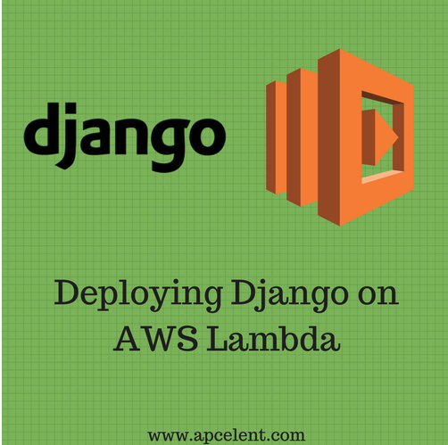

# AWS Documents

## Start from Scratch
* Google Search: AWS Management Console
[AWS Management Console](https://us-east-2.console.aws.amazon.com/console/home?region=us-east-2#)
* Click top-left AWS
## create virtual machine on remote (EC2) Elastic Computer 2
* All services: EC2 (You need edit your credit card info. if registraction incomplete)
* button:[Launch Instance]
* Step 1: Search field: DJango > Enter
    - Select Djang(Powered OpenLiteSpeed) > Continue
* Step 2: All instance types: t2.micro
    - Next: Configure instance detail
    - Review and Launch
    - Launch
    - Select an existing key pair ([Launch Instances])

[Open running project](https://18.222.182.211/Project)

```
brew install putty
puttygen privatekey.ppk -O private-openssh -o privatekey.pem
```
* All Services > EC2(Virtual machine)
```
cd ~/Downloads
chmod 400 DjangoKeys.pem
ssh -i "/Users/wangqianjiang/Downloads/DjangoKeys.pem" bitnami@ec2-18-222-182-211.us-east-2.compute.amazonaws.com

```
[Diango app](http://ec2-18-222-182-211.us-east-2.compute.amazonaws.com/Project)

#FileZilla
    - 18.222.182.211
    - username: bitnami
    - port:22

/Users/wangqianjiang/workspace/django/
* key pairs
* Running Instance
* Launch instance

Google Search: How to Deploy Django app on AWS Lambda
[Django AWS Lambda](https://blog.apcelent.com/deploy-django-app-aws-lambda.html)

## Install FileZilla
Google Search: filezilla for mac