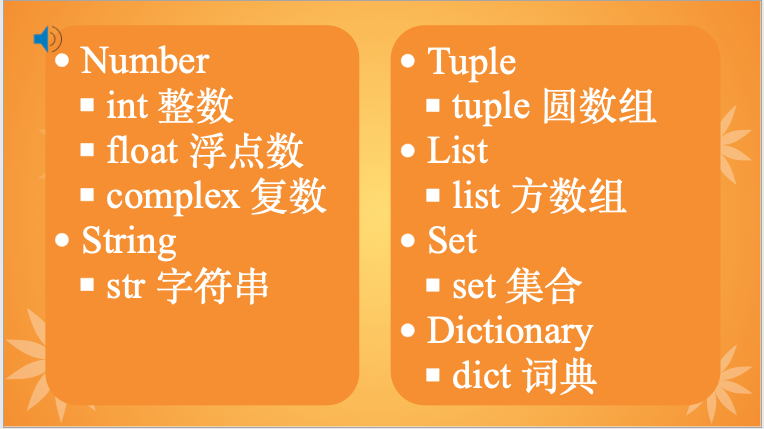

# Python Data Type



* Number
    - int
    - float
    - complex
* String
    - str
* Tuple
    - tuple
* List
    - list
* Set
    - set
* Dictionary
    - dic

python, does not like other language, determine the data type at data assignment time.
```
>>> a = 5
>>> type(a)
```